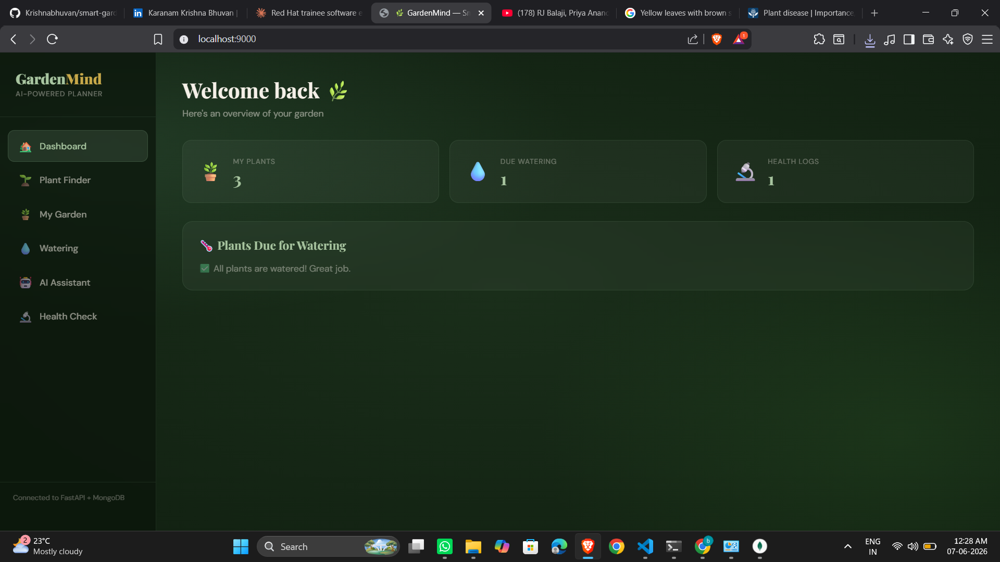
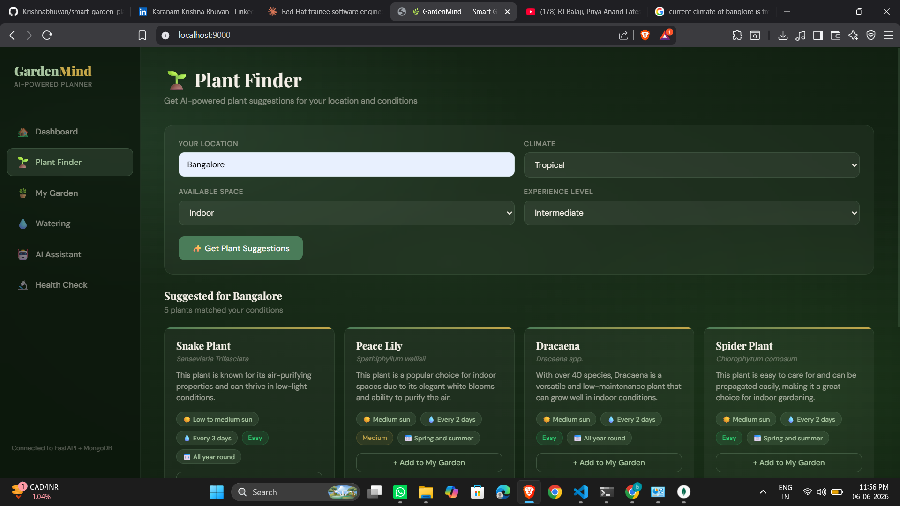
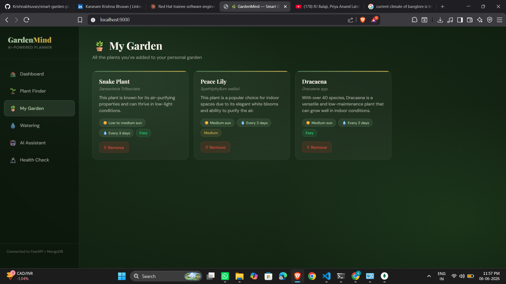
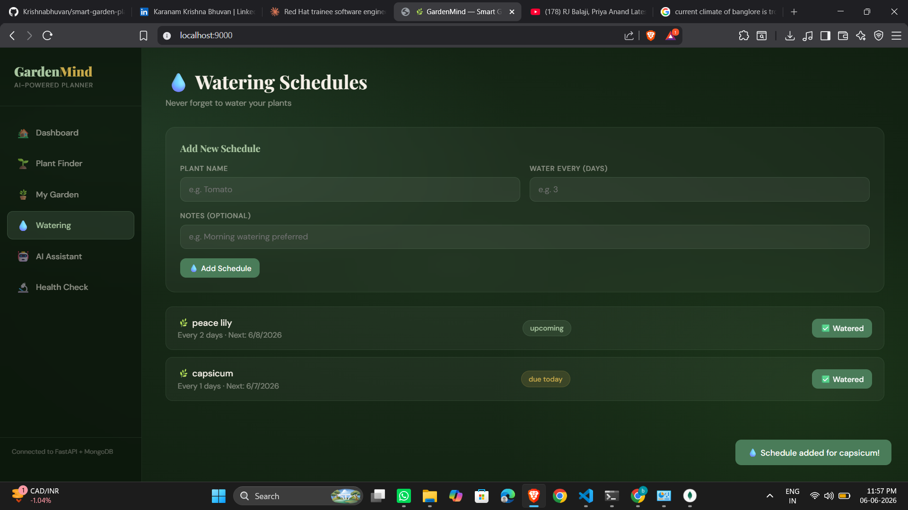
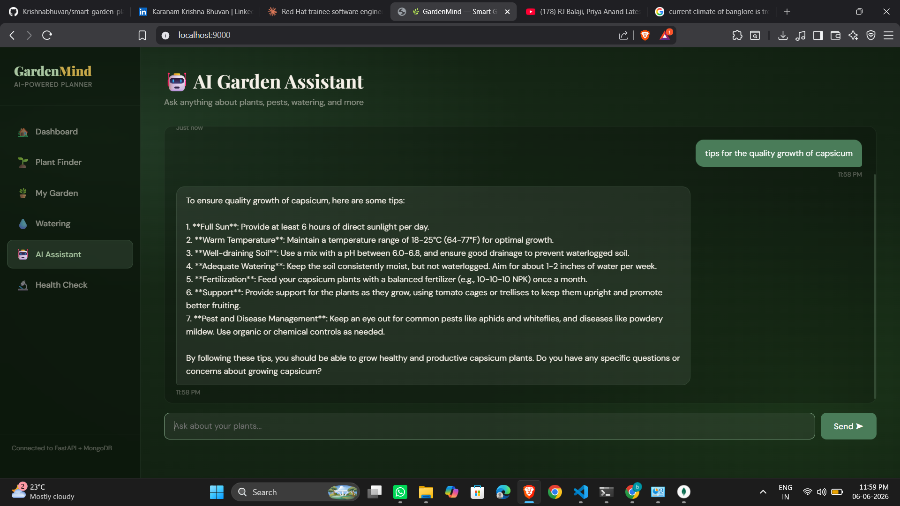
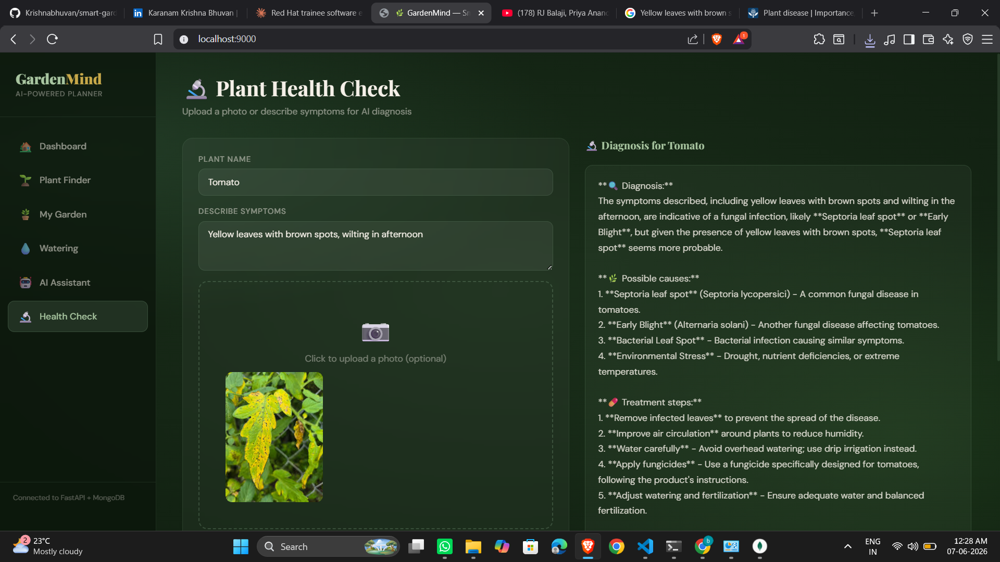

# 🌿 GardenMind — Smart Garden Planner

An AI-powered full-stack garden planning app built with **FastAPI**, **MongoDB Atlas**, and **Groq LLaMA AI**, deployed on **Microsoft Azure** via a complete DevOps pipeline.

##  Features
-**AI Plant Suggestions** — Personalized plant recommendations based on location, climate, and space
- **Watering Schedules** — Track watering frequency with overdue alerts
- **AI Chat Assistant** — Ask gardening questions to GardenBot
- **Plant Health Analyzer** — Upload a photo or describe symptoms for AI diagnosis


---

## Project Screenshots

| | |
|---|---|
|  |  |
|  |  |
|  |  |

---

##  Project Structure

```
smart-garden/
├── backend/
│   ├── main.py               # FastAPI app + serves frontend
│   ├── database.py           # MongoDB async connection
│   ├── requirements.txt
│   ├── Dockerfile
│   ├── models/
│   │   └── schemas.py        # Pydantic models
│   ├── routers/
│   │   ├── plants.py         # Plant suggestion & garden CRUD
│   │   ├── watering.py       # Watering schedules
│   │   ├── chat.py           # AI chat endpoints
│   │   └── health_tracker.py # Plant health analysis
│   ├── services/
│   │   └── ai_service.py     # Groq LLaMA integration
│   └── static/
│       └── index.html        # Frontend (served by FastAPI)
├── terraform/
│   ├── main.tf               # Azure infrastructure (ACI, ACR, RG)
│   ├── variables.tf
│   └── outputs.tf
├── ansible/
│   ├── playbook.yml          # Automated deployment playbook
│   └── inventory.ini
└── azure-pipelines.yml       # CI/CD pipeline
```

##  Setup Instructions

### 1. Prerequisites
- Python 3.10+
- MongoDB running locally or MongoDB Atlas URI
- Groq API key (free) → https://console.groq.com

### 2. Backend Setup
```bash
cd backend

# Create virtual environment
python -m venv venv
source venv/bin/activate        # Windows: venv\Scripts\activate

# Install dependencies
pip install -r requirements.txt

# Set up environment variables
# Create .env file with:
GROQ_API_KEY=your-groq-api-key
MONGO_URL=mongodb://localhost:27017

# Run the server
uvicorn main:app --reload --port 9000
```

### 3. Open in browser
http://localhost:9000
Frontend is served automatically from FastAPI — no separate setup needed!

API docs available at: **http://localhost:9000/docs**

---

##  API Endpoints

| Method | Endpoint | Description |
|--------|----------|-------------|
| POST | `/api/plants/suggest` | Get AI plant suggestions |
| POST | `/api/plants/save` | Save plant to garden |
| GET | `/api/plants/my-garden` | Get all saved plants |
| DELETE | `/api/plants/{name}` | Remove plant from garden |
| POST | `/api/watering/schedule` | Create watering schedule |
| GET | `/api/watering/schedules` | Get all schedules with status |
| POST | `/api/watering/log-watering/{id}` | Log a watering event |
| GET | `/api/watering/due-today` | Plants due for watering |
| POST | `/api/chat/message` | Chat with AI assistant |
| GET | `/api/chat/history` | Get chat history |
| POST | `/api/health/analyze` | Analyze plant health + photo |
| GET | `/api/health/logs` | Get health check history |

---

##  Tech Stack

| Layer | Technology |
|-------|------------|
| Backend | FastAPI, Python |
| Database | MongoDB (Motor async driver) |
| AI | Groq LLaMA 3.3 70B (text) + LLaMA 4 Scout (vision) |
| Frontend | Vanilla HTML/CSS/JS |
| Container | Docker |
| Registry | Azure Container Registry (ACR) |
| Infrastructure | Terraform |
| Configuration | Ansible |
| CI/CD | Azure DevOps (self-hosted agent) |
| Cloud | Microsoft Azure (Container Instances) |

---

##  DevOps Pipeline
GitHub Push → Azure DevOps Pipeline
→ Stage 1: Docker Build
→ Stage 2: Push to ACR
→ Stage 3: Ansible deploys to Azure Container Instances
→ Live at http://smart-garden-app.centralindia.azurecontainer.io--> now it is not working because cloud charging(fee) me. i am thinking screen shots will be enough as proof.

##  Docker

```bash
cd backend
docker build -t smart-garden .
docker run -p 9000:80 --env-file .env smart-garden
```

---

##  Challenges Faced

- Switched AI providers 3 times (OpenAI → Grok → Gemini) before settling on Groq free tier
- Accidentally committed 222MB Terraform binary — had to rewrite git history using `filter-branch`
- Azure DevOps self-hosted agent kept going offline mid-pipeline
- Port 8000 blocked on mobile networks — migrated everything to port 80
- MongoDB Atlas IP whitelisting blocked Azure container — fixed with network access rules